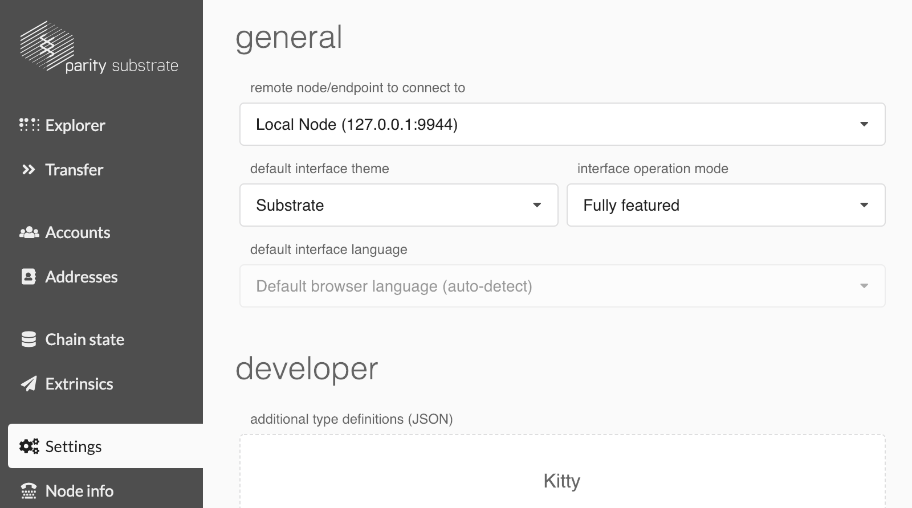
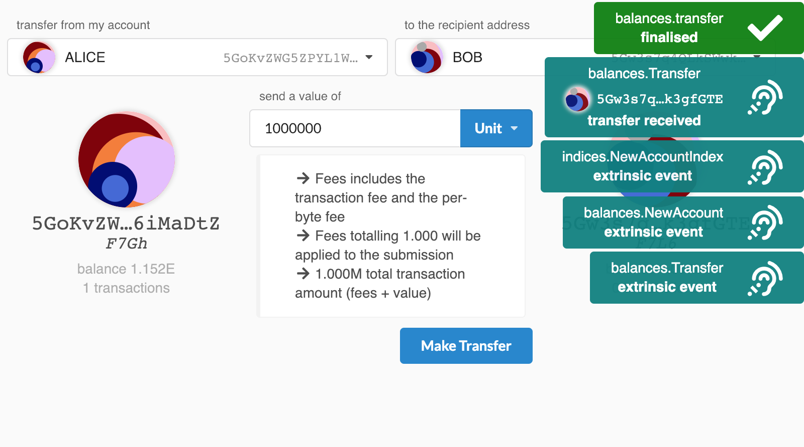

Interacting With Your Node
===

By the end of this tutorial we will have you create your own custom UI to interact with your collectables blockchain. In the meantime, we can use the [Polkadot-JS](https://polkadot.js.org) Apps UI which is a generalized interface that adapts to your custom node.

在本教程结束时，我们将为你创建自己的定制 UI，以便与你的区块链进行交互。与此同时，我们可以使用 [Polkadot-JS](https://polkadot.js.org) Apps UI，它是一个适应你自定义节点的通用界面。

Open **Chrome** and navigate to:

打开 **Chrome** 并导航至： 

https://polkadot.js.org/apps/

To point the UI to your local node, you need to adjust the **Settings**:

要将 UI 指向本地节点，你需要调整 **设置**:

```
Settings > remote node/endpoint to connect to > Local Node (127.0.0.1:9944)
```

Also change the `Default Interface Theme` to `Substrate`.

同时将 `Default Interface Theme` 更改为 `Substrate`。



After you press **Save and Reload**, you should notice the Polkadot-JS Apps UI come to life; new tabs such as *Explorer* and *Transfer* should appear.
Note that you should have your `./target/substratekitties --dev` chain up and running while browsing the Polkadot UI.

按下 **Save and Reload** 后，你应该注意到 Polkadot-JS Apps UI 重新生成; 并显示出 *Explorer* 和 *Transfer* 等新选项卡。请注意，你应该在浏览 Polkadot UI 前启动并运行 `./target/substratekitties --dev` 链。

Note that we will importing a JSON file with additional type definitions later on in section "Registering a Custom Struct" of Section 1 > Viewing a Structure.

请注意，稍后我们将在 Section 1 > Viewing a Structure 的 "Registering a Custom Struct" 部分中导入带有其他类型定义的 JSON 文件。

Let's go into the **Transfer** tab, and make a transaction. The default account named "Alice" is pre-funded with a ton of *Units*.

让我们进入 **Transfer** 标签页并进行交易。名为 "Alice" 的默认帐户预先存储了大量的 *Units*。

Share some with "Bob" by creating a transaction. You should see a confirmation appear when the transaction has completed, and Bob's balance will also be updated.

通过创建交易与 "Bob" 分享一些。你应该会在交易完成时看到确认信息，并且 Bob 的余额也会更新。



Here you can see just how quickly we set up, ran, and interacted with our own local Substrate chain.

可见我们创建，运行并且与我们自己的本地 Substrate 链进行交互的整个过程是有多么快速。

---
**Learn More**

The [Substrate UI](https://github.com/paritytech/substrate-ui) that has been built using the [oo7-substrate library](https://github.com/paritytech/oo7/tree/master/packages/oo7-substrate) is an alternative front-end interface to the [Polkadot-JS Apps UI](https://github.com/polkadot-js/apps) for interacting with your Substrate chain.

使用 [oo7-substrate library](https://github.com/paritytech/oo7/tree/master/packages/oo7-substrate) 库构建的 [Substrate UI](https://github.com/paritytech/substrate-ui) 是 [Polkadot-JS Apps UI](https://github.com/polkadot-js/apps) 用于与你的 Substrate 链进行交互的另一个前端界面。

When building your own UI, remember to refer to the [Polkadot-JS API Documentation](https://github.com/polkadot-js/api) and the [oo7 API Documentation](https://tomusdrw.github.io/oo7/).

构建自己的 UI 时，请记住参考 [Polkadot-JS API 文档](https://github.com/polkadot-js/api) 和 [oo7 API 文档](https://tomusdrw.github.io/oo7/)。
