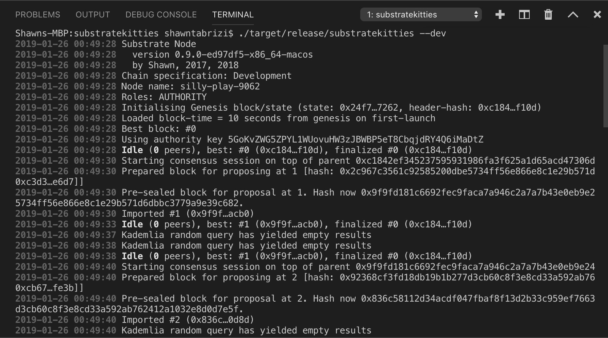

# 运行一个自定义节点

现在你已经在计算机上成功安装了 Substrate 框架，我们可以使用预先配置的模板快速启动自定义 Substrate 节点。

在终端窗口中，切换到你的工作目录并运行 `substrate-node-new --help` 以查看使用说明。出于本项目的目的，我们将选择 “substratekitties” 作为项目的名称，但你可以随意修改此名称。现在运行以下命令，其中 `<AUTHOR>` 是你的名字：

```bash
substrate-node-new substratekitties <AUTHOR>
```

> **注意**: 如果你想要了解 `substrate-node-new` 的具体内容，你可以看看 [这里](https://github.com/paritytech/substrate-up/blob/master/substrate-node-new)。

完成自定义节点编译后，你应该能够运行以下命令来启动节点：

```bash
cd substratekitties
./target/release/substratekitties --dev
```

如果你成功了，你应该能看到正在生成的块。



---

**Learn More**

使用 `--dev` 标志会让你的节点二进制文件去运行特定的链
