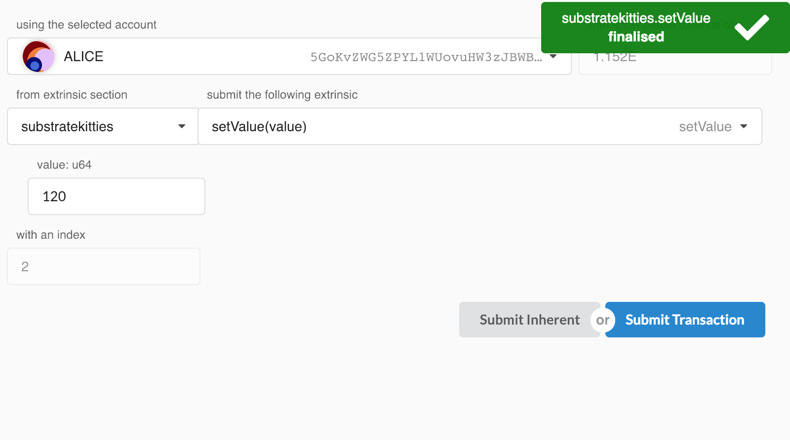
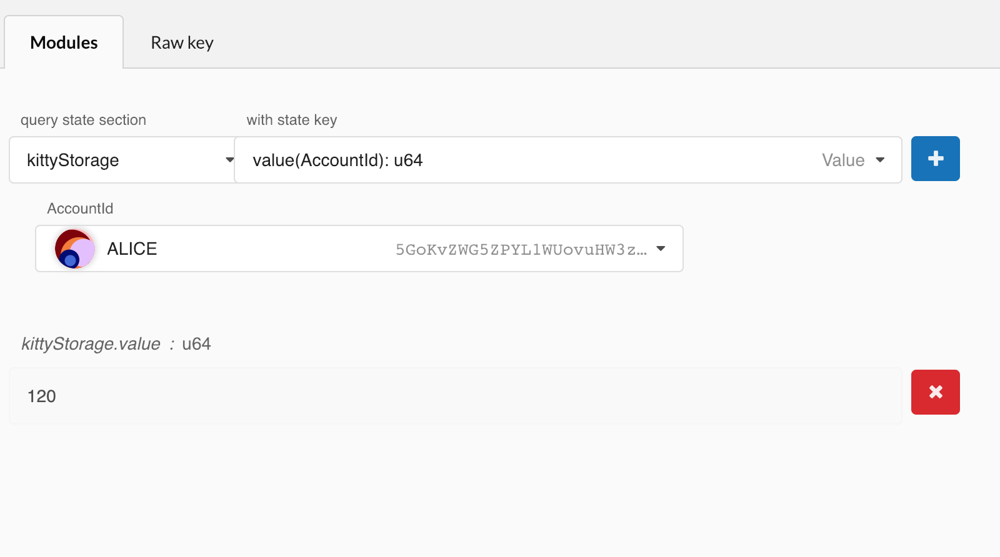

## Checking Our Work in the Polkadot UI

Even though this code should compile without errors, now would be a good time to check out our work.

即使这段代码编译没有出错，现在也是检查我们工作的好时机。

After running:

运行后：

```bash
./build.sh
cargo build --release
./target/release/substratekitties purge-chain --dev
```

We can start our node:

我们可以启动我们的节点：

```bash
./target/release/substratekitties --dev
```

If we go back into the [Polkadot-JS Apps UI](https://polkadot.js.org/apps), we should see evidence of our node producing blocks.

如果我们回到 [Polkadot-JS Apps UI](https://polkadot.js.org/apps)，我们应该看到我们的节点正在产生块。

## Submit a Transaction

Go to the **Extrinsics** tab, and using the "from extrinsic section" dropdown select:

进入 **Extrinsics** tab 页面，然后在 “from extrinsic section” 下拉列表中选择：

```
substratekitties > setValue(value)
```

Type in a value and press `Submit Transaction`:

输入值并按下 `Submit Transaction`：



## View the Storage

Now that you have submitted a transaction to put a value into storage, we should take a look that the value is actually there.

现在你已经提交了一个将值存入存储的交易，我们看看该值是否实际存在。

Go to the **Chain state** tab, and select:

转到 **Chain state** tab，然后选择：

```
kittyStorage > value(AccountId): u64
```

For the account you submitted the transaction with, query the storage and press the blue `[+]` button:

在你提交交易的帐户中，查询存储并按下蓝色 `[+]` 按钮：



You should get back the same value you stored in! You can try this with multiple accounts and see that each user is able to store their own value into the runtime storage.

你应该得到了与你存储的相同值！你可以尝试使用多个帐户，并查看每个用户是否能够将自己的值存储到 runtime 存储中。
