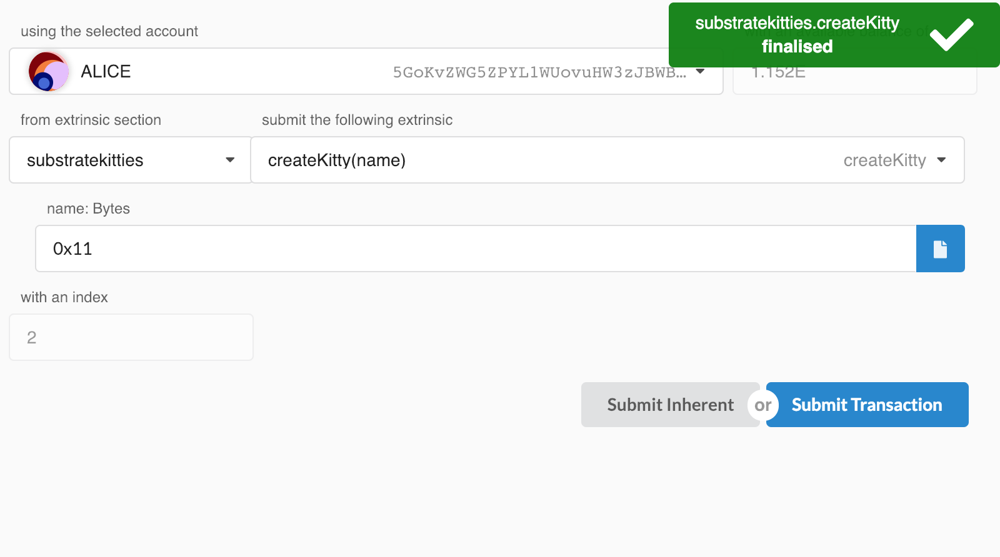
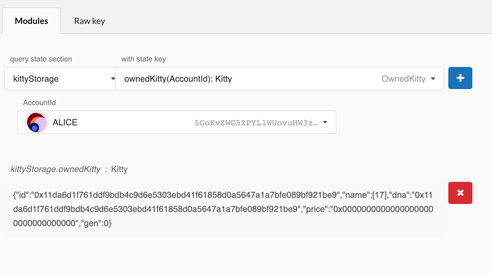

Viewing a Structure
===

Now that we have set up our runtime to make kitties, we should check our work!

We have introduced a custom structure to our chain, and while the Polkadot-JS Apps UI is very good at adapting to our changes, in this situation, we need to give it a hint on how to deserialize our structured data.

现在我们已经构建了 runtime 来制作 kitty，现在需要检查一下我们的工作！

我们已经为我们的链引入了一个自定义结构，虽然 Polkadot-JS Apps UI 非常善于适应我们的变化，但在这种情况下，我们需要给出一个关于如何反序列化结构体数据的提示。

> REMINDER: Remember to reset your chain so that you start of fresh when interacting with the UI:
>
> 提示：请记住重置你的链，以便在与 UI 交互时重新开始：
>
> ```
> ./build.sh
> cargo build --release
> ./target/release/substratekitties purge-chain --dev
> ./target/release/substratekitties --dev
> ```

## Registering a Custom Struct

Fortunately, the Polkadot-JS Apps UI provides us with a very simple way to import custom structures so that the page will be able to decode the information correctly.

幸运的是，Polkadot-JS Apps UI 为我们提供了一种非常简单的方法来导入自定义结构，以便页面能够正确解码信息。

In the **Settings** tab, under the **developer** section, there is an input field where you can submit a JSON file. Save this JSON object into a `.json` file and submit that file into the Polkadot-JS Apps UI.

在 **Settings** tab 页面的 **developer** 部分，有一个输入区域，你可以在其中提交 JSON 文件。将此 JSON 对象保存到一个 `.json` 文件中，并将该文件提交到 Polkadot-JS Apps UI 中。

```
{
    "Kitty": {
        "id": "H256",
        "dna": "H256",
        "price": "Balance",
        "gen": "u64"
    }
}
```

Finally press `Save & Reload`.

最后按下 `Save & Reload`。

## Creating a Kitty

Now we can go and create a new kitty. In the **Extrinsics** tab, go to:

现在我们可以去创造一个新的 kitty。在 **** tab 页面中，进入：

```
substratekitties > createKitty()
```

Once you press submit, you should see the transaction finalize:

按下提交后，你应该看到交易完成：



## Viewing a Kitty

Finally, we can go into the **Chain State** tab, and view our stored kitty object. Select:

最后，我们可以进入 **Chain State** tab 页面，查看我们存储的 kitty 对象。选择：

```
kittyStorage > ownedKitty(AccountId): Kitty
```

Then select a user who has called the `createKitty()` function. You should then be able to see the individual properties of the `Kitty` object:

接着选择已调用 `createKitty()` 函数的用户。然后，你应该能够看到 `Kitty` 对象的各个属性：



---
**Learn More**

Talk about serialization and deserialization.

How we simply transfer and transmit raw bytes

[TODO: make this a page]

谈论序列化和反序列化。

我们如何简单地传输原始字节

---
