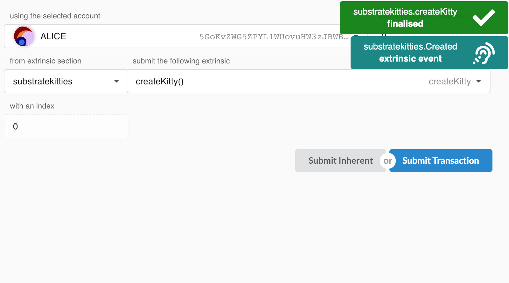
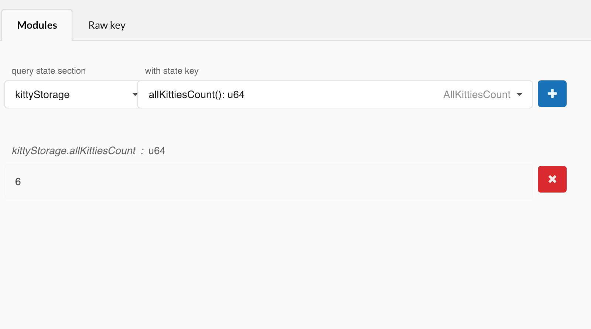
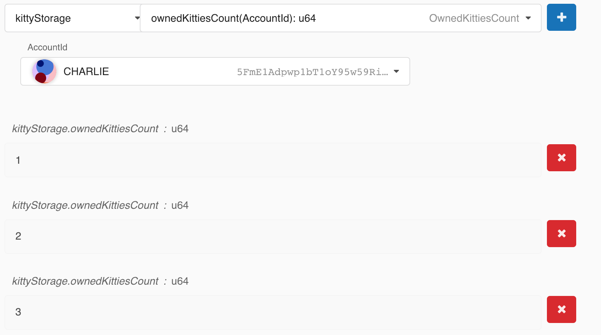
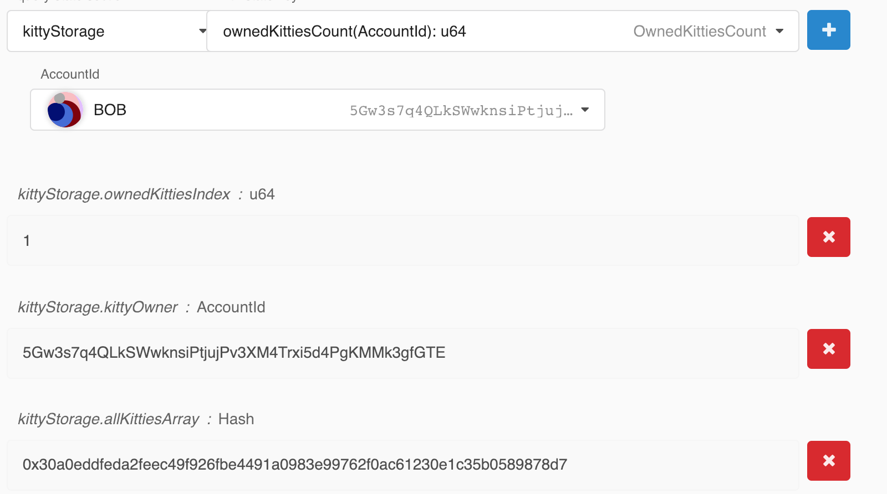

Viewing Multiple Kitties
===

We added a lot of items to our runtime storage since we last played around with the Polkadot UI, not to mention that our storage structure is also a bit more complex. Now is a good opportunity to take a look at what we have done so far, and check out how we can navigate through the kitties being generated in our runtime.

自从我们上次使用 Polkadot UI 以来，我们在 runtime 存储中添加了很多项，更不用说我们的存储结构也有点复杂了。现在是一个很好的时机来看看我们到目前为止所做的工作，并了解一下我们如何浏览在 runtime 生成的 kitties。

Remember to start a clean version of your chain before jumping into the UI:

在进入 UI 之前，请记住启动链的船新版本 :P ：

```
./build.sh
cargo build --release
./target/release/substratekitties purge-chain --dev
./target/release/substratekitties --dev
```

## Funding and Using Multiple Accounts

The first thing you want to do is transfer funds from Alice to a few of the provided accounts. Let's send funds to both Bob and Charlie.

你要做的第一件事是将资金从 Alice 转移到一些已经被提供的帐户里。让我们向 Bob 和 Charlie 汇款吧。

Now we will go into the **Extrinsics** tab, where we will select our `create_kitty()` function in the UI:

现在我们将进入 **Extrinsics** tab 页面，在 UI 中选择我们的 `create_kitty()` 函数：

```
substratekitties > createKitty()
```

For our test we will have Alice create 3 kitties, Bob create 2 kitties, and Charlie create 1.

在我们的测试中，我们将让 Alice 创建 3 个 kitties，让 Bob 创建 2 个 kitties，让 Charlie 创建 1 个 kitty。



## Viewing Our Storage

Now we can explore all the storage items we set up an make sure things are working correctly.

现在我们可以浏览我们设置的所有存储项，确保一切正常。

First we should check the total number of kitties in our system:

首先，我们应该检查系统中的 kitty 总数：

```
kittyStorage > allKittiesCount(): u64
```

If all went right, we should get the value `6` returned.

如果一切顺利，我们应该得到返回值 6 。



Next we should check the kitty count for each user, expecting 3 for Alice, 2 for Bob, and 1 for Charlie:

接下来我们应该检查每个用户的 kitty 数量，Alice 为 3，Bob 为 2，Charlie 为 1：



If we look at `AllKittiesArray`, we should be able to get each kitty by their global index. I will look at the 5th kitty (which is index 4), and confirm the owner is Bob. Furthermore, we can confirm that this is Bob's 2nd kitty since the relative `OwnedKittiesIndex` is `1`.

如果我们看下 `AllKittiesArray`，我们应该能够通过它们的全局索引获得每个 kitty。我将看第五个 kitty (index 为 4)，并确认所有者是 Bob。此外，我们可以确认这是 Bob 的第 2 个 kitty，因为相对的 `OwnedKittiesIndex` 是 `1`。



## Your Turn!

There are still a couple of storage items we didn't check out yet. Spend some time and a little bit of brain juice to make sure everything works as it should. If you find an error, go back to your runtime to see if you can spot where the problem is.

还有一些我们尚未检查的存储项。花一些时间来确保一切正常。如果发现错误，请回到 runtime 以查看是否可以找出问题所在。
