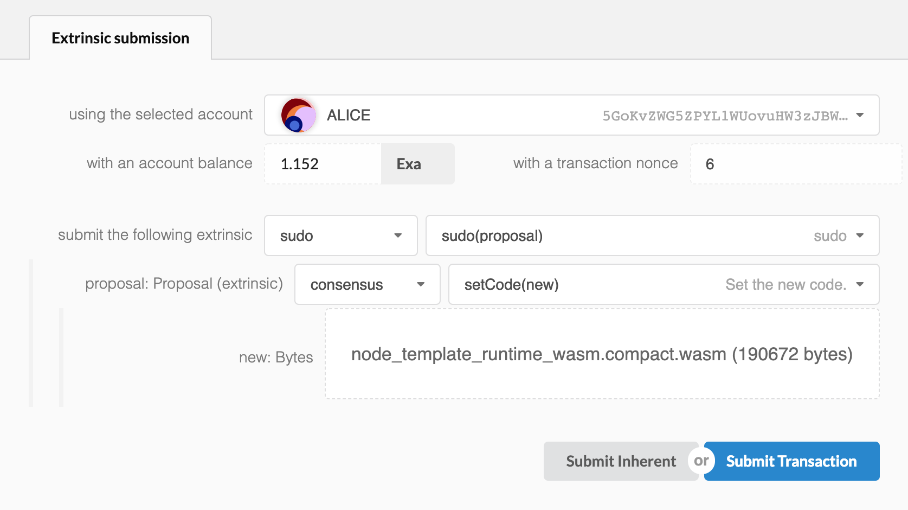
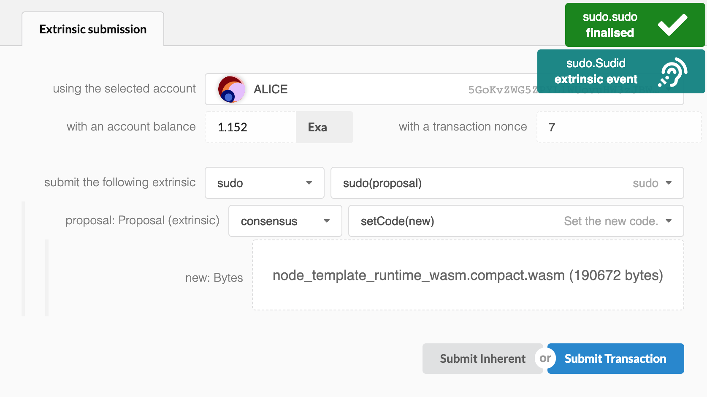
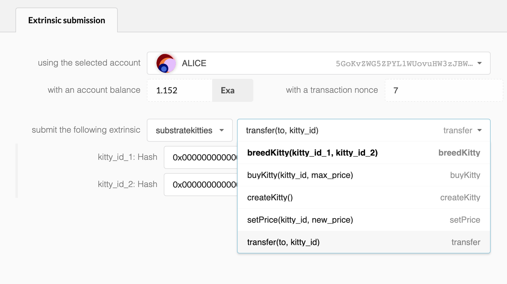

Breeding a Kitty
===

Probably the most unique part of the original CryptoKitties game is the ability to breed new kitties from existing ones.

原始 CryptoKitties 游戏中最独特的部分可能是从现有 kitty 中培育出新的 kitty。

We have prepared our `Kitty` object with this in mind, introducing `dna` and `gen` which will be used in forming brand new kitty offspring.

我们已经准备好了我们的 `Kitty` 对象，引入了将用于形成全新的 kitty 后代的 `dna` 和 `gen`。

## Passing Down Traits

In our UI, we will be generating our kitties image using the kitty DNA. In our runtime, the DNA is a 256 bit hash, which is represented by as a bytearray in our code, and a hexadecimal string in our upcoming UI.

在我们的 UI 中，我们将使用 kitty DNA 生成我们的 kitties 图像。在我们的 runtime 中，DNA 是 256 位的 hash 值，在我们的代码中用 bytearray 表示，在我们即将实现的 UI 中用十六进制字符串表示。

This means that there are 32 elements, each of which can be a value from 0 - 255. We will use these elements to determine which traits our kitties have. For example, the first index of the byte array can determine the color of our kitty (from a range of 256 colors); the next element could represent the eye shape, etc...

这意味着有 32 个元素，每个元素可以是 0 到 255 之间的值。我们将使用这些元素来确定我们的 kitty 有哪些特征。例如，byte array 的第一个索引可以确定 kitty 的颜色（从256种颜色的范围）;下一个元素可以代表眼睛形状等...

```
Attribute:  Color Eyes Hair Collar Accessory
DNA:        [233] [15] [166] [113] [67] ...
```

When we breed two kitties, we want the offspring to have some combination of the parent's genetics. What we will do for our game is randomly choose one of the parents to give their attribute to the child kitty.

当我们培育两只 kitty 时，我们希望后代的属性有一些来自父母的遗传。我们将为我们的游戏做的是随机选择一位父母将其属性赋予孩子。

```
Kitty1 DNA:   [212] [163] [106] [250] [251] [  0] [ 75]...
                |     |                       |
Child DNA:    [212] [163] [ 69] [195] [223] [  0] [201]
                            |     |     |           |
Kitty2 DNA:   [233] [ 49] [ 69] [195] [223] [133] [201]...
```

We provide you with the gene splicing algorithm in your template, but feel free to make modifications.

我们在模板中为你提供基因拼接算法，但你可以随意进行修改。

## Chain Upgrade (Optional)

One of the cool features of Substrate is the ability to do forkless, real-time chain upgrades which introduce new features and functionality to your blockchain without breaking existing nodes.

Substrate 的一个很酷的功能是能够进行无分叉的实时链升级，这可以为区块链引入新特性和功能，而不会破坏现有节点。

Rather than purging your chain and rebuilding the native binaries to introduce the `breed_kitty()` function, we will show you how you can use just the Wasm runtime to upgrade your chain.

我们将向你展示如何仅使用 Wasm runtime 来升级你的链，而不是清除你的链并重建本机二进制文件以引入 `breed_kitty()` 函数。

Keep your node running from the previous section, and in a new terminal run just:

保持上一节的节点一直运行，并在新的终端中运行：

```
./build.sh
```

This will generate a new compact Wasm binary in the following path:

这将在以下路径中生成一个新的紧凑的 Wasm 二进制文件：

```
./runtime/wasm/target/wasm32-unknown-unknown/release/node_template_runtime_wasm.compact.wasm
```

We can now use this file in the Polkadot UI to upgrade your chain. Go to the **Extrinsics** section of the Polkadot UI, and select:

我们现在可以在 Polkadot UI 中使用此文件来升级你的链。转到 Polkadot UI 的 **Extrinsics** 部分，然后选择：

```
submit the following extrinsic: sudo > sudo(proposal)
    proposal: Proposal (extrinsic): consensus > setCode(new)
```



Then use the `compact.wasm` file as the input into this call. Make sure to call this function as **Alice** who was set in the genesis configuration to be the 'admin' allowed to make `Sudo` calls.

然后使用 `compact.wasm` 文件作为此次调用的输入。确保执行此函数， 因为在 genesis 配置中设置的 **Alice** 是允许进行 `Sudo` 调用的 `admin`。

After you press **Submit Transaction** and a block is created, you should see a `Sudid` event appear showing that the contract upgrade was successful!

按下 **Submit Transaction** 创建一个块后，你应该可以看到一个显示合同升级成功的 `Sudid` event！



Finally, if we refresh the page and look at the extrinsics available in our Substratekitties module, we will find the `breedKitty()` function now appearing.

最后，如果我们刷新页面并查看 Substratekitties 模块中可用的 extrinsics，我们会发现现在出现了 `breedKitty()` 函数。



If you had any saved state before the upgrade (for example Kitties, balances, etc...), you will see that this state is preserved after the Runtime upgrade. At this point, your blockchain is running the Wasm version of the runtime through the Wasm interpreter provided by Substrate. This runtime lives on the blockchain, which means that it gets synced to all nodes running your chain, and thus keeps your network in sync with each other. Running Wasm in an interpreter is slower than running native code, so you can always do a full node upgrade by building a new executable with `cargo build --release` and restarting your node.

如果你在升级之前有任何已保存状态（例如 Kitties，balances 等等），你将看到在 runtime 升级后此状态仍然被保留。此时，你的区块链通过 Substrate 提供的 Wasm 解释器运行 runtime 的Wasm 版本。此 runtime 存在于区块链中，这意味着它会同步到运行链的所有节点，从而使你的网络保持彼此同步。在解释器中运行 Wasm 比运行原生代码慢，因此你总是可以通过命令 `cargo build --release` 来编译一个新的可执行文件来完成完整的节点升级并重启节点。

## Your Turn!

You will find that refactoring our `_mint()` function in chapter 2 will help us a lot for this final step. Generate a new kitty using the gene splicing algorithm on two input kitties.

你将发现在第 2 章中我们重构的 `_mint()` 函数将对我们的最后一步有很大帮助。使用基因拼接算法在两个输入的 kitties 上生成一个新的 kitty。

Make sure to increment the `gen` value to be one more than the max of the parent kitties. This way, we can keep track of breeded kitties versus one generated from scratch.

确保增加 `gen` 值使得新 kitty 只比父母 kitties 的最大值大一。通过这种方式，我们可以跟踪那些从一开始培育的 kitties。

Then pass that kitty object to the `_mint()` function to create your new kitty!

然后将该 kitty 对象传递给 `_mint()` 函数以创建新的 kitty！

Finally, if you are feeling brave, do a live runtime upgrade to add this new feature to your blockchain. You should find that all of your existing storage items will be unaffected by the upgrade, however, you will now have access to this new function!

最后，如果你够勇敢的话，请进行实时 runtime 升级，以将此新功能添加到区块链中。你会发现所有现有存储项都不受升级的影响，现在你可以访问这个新功能了！

<!-- tabs:start -->

#### ** Template **

[embedded-code](./assets/3.4-template.rs ':include :type=code embed-template')

#### ** Solution **

[embedded-code-final](./assets/3.4-finished-code.rs ':include :type=code embed-final')

<!-- tabs:end -->