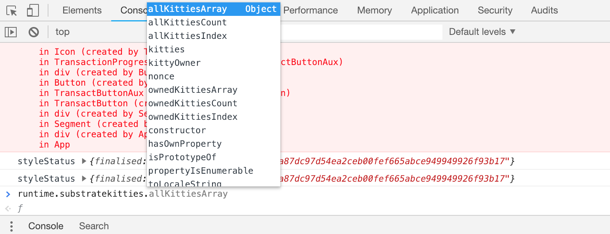

Explore the Substrate UI
===

The Substrate UI has a lot going on inside. We will try to simplify some of the concepts and enable you to start customizing your UI.

Substrate UI 里面有很多内容。我们将尝试简化一些概念，使你能够开始定制你的 UI。

## Bare Bones Substrate UI

The `substrate-ui` template comes with a number of prebuilt features that you might expect from the average Blockchain UI.

- A wallet to manage and create keys + accounts
- An address book to get details about accounts
- A transfer function to send funds between accounts
- A runtime upgrade UX to make easy updates to your runtime

`substrate-ui` 模板预建了一般区块链 UI 中的这些功能。

- 用于管理和创建密钥+帐户的钱包
- 用于获取帐户详细信息的地址簿
- 在账户之间发送资金的转账功能
- 可以轻松更新 runtime 的 UX

## Runtime Upgrade

Up until now, we have had you "purge" your chain and generate new binaries every time you wanted to make changes to your runtime. However, Substrate is unique in that it allows for "forkless upgrades" where you are able to upgrade your runtime logic without causing problems to your network.

到目前为止，我们已经让你 “purge” 你的链并在每次想要对 runtime 进行更改时生成新的二进制文件。但是，Substrate 的独特之处在于它允许 “无分叉升级”，你可以在其中升级 runtime 逻辑而不会对网络造成问题。

You might try this if you make logical changes to some of your functions as suggested in the challenges at the end of chapter 3. Take a look [here](https://substrate.readme.io/docs/creating-a-custom-substrate-chain#section-step-5-upgrade-our-chain) for some more details.

如果你按照第 3 章末尾的挑战中的建议对某些功能进行逻辑更改，则可以尝试此操作。请查看[此处](https://substrate.readme.io/docs/creating-a-custom-substrate-chain#section-step-5-upgrade-our-chain)了解更多详细信息。

## React Components

If you peak into the Substrate UI code, you will see that it is made up of React Components that each serve their own purpose. As mentioned, the Substrate UI comes with a set of prebuilt features, and you can find the components which power those features in the `src` folder.

如果您进入 Substrate UI 代码，你将看到它是由 React Components 组成，每个 React Component 都有自己的用途。如上所述，Substrate UI 附带了一组预建功能，你可以在 `src` 文件夹中找到为这些功能提供支持的组件。

All of these components are put together in the `src/app.jsx` file, which powers the main view that you see.

所有这些组件都放在 `src/app.jsx` 文件中，该文件为你看到的主视图提供支持。

## Reading Our Runtime

You can see that the Substrate UI has access to our blockchain. More impressive is that it is already aware of the new module you created, along with the features and functionalities you added to that module. Let's explore some of the ways you can poke around and explore your module from the perspective of the Substrate UI.

你可以看到 Substrate UI 可以访问我们的区块链。更令人印象深刻的是，它已经知道你创建的新模块，以及你添加到该模块的特性和功能。让我们从 Substrate UI 的角度探索一些可以查看模块的方法。

For this we will be working in your browser's console and using the autocomplete while the Substrate UI is open and running. This is usually accessible by pressing `F12`, or going into `Inspect Element` mode.

为此，在 Substrate UI 打开并运行的时候，我们将会在你的浏览器控制台中工作并使用自动补全。通常可以通过按 `F12` 或进入 `Inspect Element` 模式来访问它。

If we go into the console and type (note the dot at the end):

如果我们进入控制台并输入（注意末尾的点）：

```
runtime.
```

We should see a list of autocomplete options that our browser is aware of:

我们应该看到浏览器自动补全的选项列表：


You might notice that these are our modules! Better yet, we can see `substratekitties`. Let's go deeper.

你可能会注意到这些是我们的模块！更好的是，我们可以看到 `substratekitties`。让我们更深入进去看看。

```
runtime.substratekitties.
```



Here we can see all of the storage items our module exposes. Let's read from one of them:

在这里，我们可以看到我们模块中公开的所有存储项。让我们读取其中一个：


```javascript
> runtime.substratekitties.allKittiesCount.then(console.log)

8

> runtime.substratekitties.allKittiesArray(0).then(console.log)

Hash(32) [58, 60, 214, 1, 126, 230, 54, 236, 38, 35, 250, 236, 81, 248, 64, 83, 234, 152, 174, 39, 114, 24, 108, 34, 128, 61, 74, 136, 74, 38, 206, 48]

> runtime.substratekitties.allKittiesArray(7).then(console.log)

Hash(32) [162, 202, 153, 236, 47, 9, 134, 176, 171, 201, 222, 149, 39, 69, 7, 46, 241, 155, 195, 52, 211, 62, 170, 24, 130, 50, 252, 36, 126, 209, 153, 38]
```

You can see that this example runtime has 8 kitties, all of which you can access from the `allKittiesArray`. (Note that the element is the `kitty_id` hash with 32 elements from 0-255 (32 elements * 8 bits = 256 bit hash).)

你可以看到此示例 runtime 有8个 kitties，你可以从`allKittiesArray` 访问所有 kitties。 （注意，该元素是 `kitty_id` 哈希，其中包含32个元素，范围为0-255（32个元素* 8位= 256位哈希）。）

## Using Runtime Variables in Substrate UI

We can start off simple and try to update the Substrate UI to include a live kitty count on the page.

我们可以从简单开始，并尝试更新 Substrate UI 页面上包含的 live kitty 计数。

The variables we showed above are Bonds, which means their values will update automatically as changes to your blockchain happen. However, that also means that you need to work with these variables a little differently than normal (note that we used promises in the example above).

我们上面显示的变量是Bonds，这意味着当区块链发生变化时，它们的值会自动更新。但是，这也意味着你去使用这些变量，会与正常情况下有一点不同（请注意，我们在上面的示例中使用了 promises）。

Fortunately, for our example, we will use some of the components already built for us. In this case we will use an aptly-named component called `Pretty` which turns most any bond into a readable string. You can see it being used on other parts of the page.

幸运的是，对于我们的示例，我们将使用为我们预构建的一些组件。在这种情况下，我们将使用名为 `Pretty` 的组件，它将大多数 bond 绑定为可读字符串。你可以看到它正在被页面中的其他部分使用。

In our example blockchain:

在我们的示例区块链中：

```
<Pretty value={runtime.substratekitties.allKittiesCount}/>
```

Would convert to:

会转换成：

```
<span>8</span>
```

Additionally, as the value for `allKittiesCount` changes, our HTML will automatically update to represent the latest value. This is thanks to React states, which automatically re-render the contents of the component.

此外，随着 `allKittiesCount` 值的更改，我们的 HTML 将自动更新以表示最新值。这要归功于 React 状态，它会自动重新呈现组件的内容。

## Your Turn!

In the template, we currently have a `Subheader` which says:

在模板中，我们目前有一个 `Subheader`，它显示：

```javascript
<Header.Subheader>There are 0 kitties purring.</Header.Subheader>
```

Update the `0` value to represent the current number of kitties tracked in our runtime. Then add some kitties using the Polkadot UI and confirm the value is automatically updated.

更新 `0` 值以表示在我们的 runtime 中追踪的当前 kitties 数量。然后使用 Polkadot UI 添加一些 kitties 并确认自动更新的值。

<!-- tabs:start -->

#### ** Template **

[embedded-code](./assets/4.2-template.js ':include :type=code embed-template')

#### ** Solution **

[embedded-code-final](./assets/4.2-finished-code.js ':include :type=code embed-final')

<!-- tabs:end -->