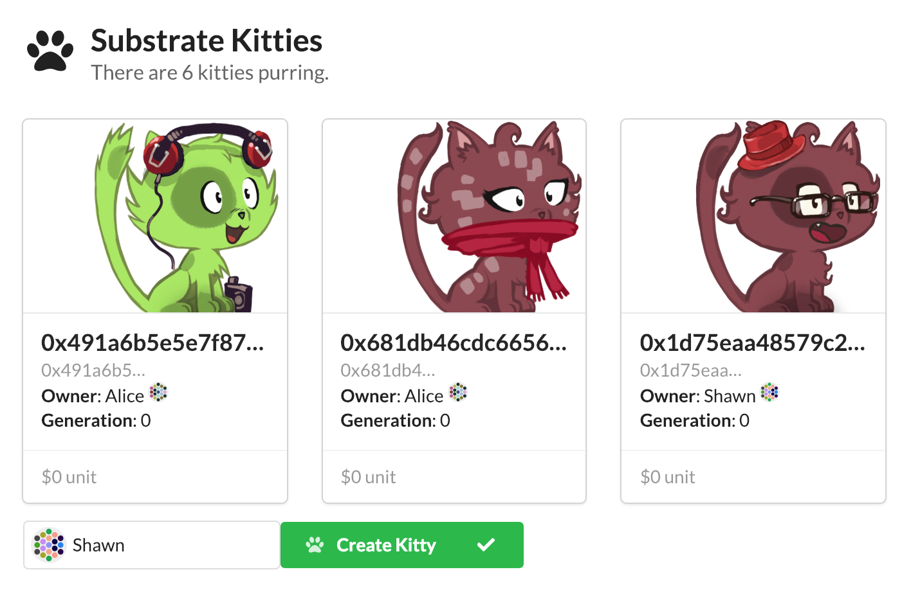

Rendering Kitties
===

If you made it this far, then you have truly earned what we are about to do in this section: Add kitties to our UI.

如果你做到这一部分了，那么你即将真正完成我们本节中要做的事情：在我们的 UI 中添加 kitty。

## Adding Our Custom `KittyCard` Component

We have built a custom React component for showing kitties. It is not so complicated, but for the purposes of this workshop, we will not have you build it. You can download the component as a `.zip` [here](./assets/KittyCards.zip).

我们已经构建了一个自定义的 React 组件来显示小猫。它并不复杂，但就本教程而言，我们不会让你构建它。你可以在 [此处](./assets/KittyCards.zip) 下载 `.zip` 组件。

To add it, you must place the `KittyCards` folder in your `src` folder:

要添加它，你必须将 `KittyCards` 文件夹放在 `src` 文件夹中：

```
substratekitties-ui
|
+-- src
    |
    +-- src
        |
        +-- KittyCards      <-- Place here
        |
        +-- AccountIdBond.jsx
        |
        +-- ...
```

Then, inside the main `app.jsx` file you need to import this component:

然后，在 `app.jsx` 文件中，你需要导入此组件：

```javascript
import {KittyCards} from './KittyCards';
```

This will give you access to the `<KittyCards>` component:

这将使你可以访问 `<KittyCards>` 组件：

```
<KittyCards count={runtime.substratekitties.allKittiesCount}/>
```

### Add the `Kitty` Type

Before this component will work, we need to add tell the Substrate UI about our custom `Kitty` type. We can do that with the `addCodecTransform()` function made available to us by the oo7 JavaScript.

在此组件工作之前，我们需要添加我们的自定义 `Kitty` 类型。我们可以使用 oo7 JavaScript 提供的 `addCodecTransform()` 函数来实现这一点。

In the case of our kitty object, it would look like this:

对于我们的 kitty 对象，它看起来像这样：

```
addCodecTransform('Kitty<Hash,Balance>', { 
    id: 'Hash',
    dna: 'Hash',
    price: 'Balance',
    gen: 'u64'
});
```

We can add this to our application's `constructor()` function to ensure it gets loaded at the start. After this, we can interact with the attributes of the `Kitty` object like we could any other JSON object.

我们可以将它添加到我们应用程序的 `constructor()` 函数中，以确保它在开始时被加载。在此之后，我们可以像任何其他 JSON 对象一样与 `Kitty` 对象的属性进行交互。

> Note: The codec transform uses a key/value pair to look up the object structure that should be used for deserialization. As a result, it is important that your "object name" matches exactly what is expected. In this situation, note there are no spaces in the object name. If the Substrate UI cannot find the right key for a custom object, it will give you an error in your browser console with the exact object name it is expecting.
>
> 注意： 编解码器转换使用键/值对来查找应该用于反序列化的对象结构。因此，让你的 “object name” 与预期完全匹配是非常重要的。在这种情况下，请注意 obejct name 中没有空格。如果 Substrate UI 无法找到自定义对象的正确密钥，它将在浏览器控制台中显示一个错误，其中包含预期的确切对象名称。

## Peek Inside Our Custom Component

Since we won't have you build this component, we will show you some of the working pieces instead.

由于我们不会为你构建此组件，因此作为替代我们将向你展示一些工作组件。



### Dynamic Card Loading

Let's quickly walk through the parts of `/KittyCards/index.jsx` to show how we are able to dynamically load new cards when kitties are added to the system.

让我们快速浏览 `/KittyCards/index.jsx` 的各个部分，以展示当把 kitty 添加到系统时我们如何动态加载新的卡片。

We call the `KittyCard` component from our  UI with:

我们从 UI 调用 `KittyCard` 组件：

```
<KittyCards count={runtime.substratekitties.allKittiesCount}/>
```

This component is tied to the `allKittiesCount` bond, that will automatically update as the state of our blockchain changes.

此组件绑定在 `allKittiesCount` bond 上，随着区块链状态的更改，它将自动更新。

When `allKittiesCount` changes, the `readyRender()` part of our `KittyCards` component triggers, which grabs the latest count, and loops over each item in the `allKittiesArray()` which will return the unique kitty id `Hash`.

当 `allKittiesCount` 改变时，我们的 `KittyCards` 组件的 `readyRender()` 部分被触发，它抓取最新的计数，并遍历 `allKittiesArray()` 中的每个项目，这将返回唯一的 kitty id `Hash`。

```javascript
    readyRender() {
        let kitties = [];
        for (var i=0; i < this.state.count; i++){
            kitties.push(
                <div className="column" key={i}>
                    <KittyWrap hash={runtime.substratekitties.allKittiesArray(i)} />
                </div>
            );
        }
```

This then send the kitty id `Hash` to the `KittyWrap` component which does a simple lookup for the `owner` and the `Kitty` object. If the `hash` sent to `KittyWrap` doesn't change between loops, then React will simply skip the re-rendering process.

然后将 kitty id `Hash` 发送到 `KittyWrap` 组件，该组件对所有者和 Kitty 对象进行简单查找。如果发送给 `KittyWrap` 的 `hash` 在循环中没有变化，那么 React 将跳过重新渲染过程。

```javascript
class KittyWrap extends ReactiveComponent {
    constructor(props) {
        super(['hash'])
    }

    readyRender() {
        return <KittyCard
            kitty={runtime.substratekitties.kitties(this.state.hash)}
            owner={runtime.substratekitties.kittyOwner(this.state.hash)}
        />
    }
}
```

Finally, `KittyWrap` calls `KittyCard` which actually produces the contents of each card.

最后，`KittyWrap` 调用实际产生每张卡内容的 `KittyCard`。

### Card Contents

Our `KittyCard` component takes the `Kitty` object passed from `KittyWrap`, as well as the owner, and formats all data. From top to bottom:

- The Kitty ID
- The Kitty DNA (which is the same for kitties that are gen 0)
- The Kitty Owner
- The Kitty Generation
- The Kitty Price

我们的 `KittyCard` 组件获取从 `KittyWrap` 传递的 `Kitty` 对象以及所有者，并格式化所有数据。从上到下为：

- Kitty ID
- Kitty DNA（与 0 代 kitties 相同）
- Kitty 所有者
- Kitty 子孙
- Kitty 价格

```javascript
<Card>
    <KittyAvatar dna={kitty.dna} />
    <Card.Content>
        <Card.Header><Pretty value={kitty.id} className="limit-name" /></Card.Header>
        <Card.Meta>
            <Pretty value={kitty.dna} className="limit-dna" />
        </Card.Meta>
        <Rspan>
            <b>Owner</b>: {secretStore().find(this.state.owner).name}
        </Rspan>
        &nbsp;
        <Identicon key={this.state.owner} account={this.state.owner} size={16}/>
        <br />
        <Rspan>
            <b>Generation</b>: {kitty.gen}
        </Rspan>
        <br />
    </Card.Content>
    <Card.Content extra>
        <Pretty value={kitty.price} prefix="$" />
    </Card.Content>
</Card>;
```

You can see we are using bonds and other Substrate UI components throughout to make the final render.

你可以看到我们正在使用 bond 和其他 Substrate UI 组件来进行最终渲染。

### Generating Kitties from DNA

You can see that our `KittyCard` has one more layer of abstraction in the `<KittyAvatar>` component.

你可以看到我们的 `KittyCard` 在 `<KittyAvatar>` 组件中还有一层抽象。

If you look in the `/KittyCards/avatars/index.jsx you will see a final React component which manages the generation of the kitty images.

如果查看 ``/KittyCards/avatars/index.jsx`，你将看到最终用于管理 kitty 图像生成的 React 组件。

The core function in the component is `dnaToAttributes()`:

组件中的核心函数是 `dnaToAttributes()`：

```
function dnaToAttributes(dna) {
    let attribute = (index, options) => {
        return dna[index] % options
    };

    return {
        body: IMAGES.body[attribute(0, 15)],
        eyes: IMAGES.eyes[attribute(1, 15)],
        accessory: IMAGES.accessories[attribute(2, 20)],
        fur: IMAGES.fur[attribute(3, 10)],
        mouth: IMAGES.mouth[attribute(4, 10)]
    }
} 
```

The kitty DNA is an array of bytes (0-256), and we map the first 5 bytes to control the specific attribute chosen for a kitty. Not only can you see that we can have 256 configurable options per attribute, but we can have up to 256 attributes too!

kitty DNA 是一个字节数组（0-256），我们映射前 5 个字节来控制 kitty 的特定属性选择。你不仅可以看到每个属性拥有 256 个可配置选项，而且我们最多也可以拥有 256 个属性！

We used the [Cat Avatar Generator](https://framagit.org/Deevad/cat-avatar-generator/tree/master) project by David Revoy to power our images, but the sky is the limit if you can find a good artist.

我们使用 David Revoy 的 [Cat Avatar Generator](https://framagit.org/Deevad/cat-avatar-generator/tree/master) 项目为我们的图像提供动力，但如果你能找到一位优秀的艺术家，那么呈现效果将是没有极限的。

## Your Turn!

Now that you understand how the `KittyCard` component works, it's time to integrate it into your Substrate UI. This should be trivial since the React component does all of the hard work.

现在你已经了解了 `KittyCard` 组件的工作原理，现在可以将其集成到你的 Substrate UI 中了。这应该是没什么难的，因为 React 组件完成了所有的艰苦工作。

After you are done, try creating a kitty and watch your UI update! You can also try out your other Runtime functions by initiating the transaction in the Polkadot UI in a different tab.

完成后，尝试创建一个 kitty 并观看你的 UI 更新情况！你还可以通过在另一个选项卡中的 Polkadot UI 启动交易来尝试其他 runtime 功能。

Do you want to test your React + JavaScript + Bonds skills? We have only integrated one function of our runtime, but there are plenty more that you can try to build:

- Setting the price of a kitty
- Buying a kitty
- Showing the kitties for a specific owner
- Breeding kitties
- etc...

你想测试你的 React + JavaScript + Bonds 技能吗？我们只集成了 runtime 的一个函数，但是还有很多可以尝试构建的函数：

- 设定一只 kitty 的价格
- 买一只 kitty
- 显示特定所有者的 kitties
- 饲养 kitties
- 等等...

Also think about how you might need to change the `KittyCards` component if you introduce a way to remove kitties from your runtime (setting them free!).

如果你引入一种从 runtime 删除 kitties 的方法，还要考虑如何更改 `KittyCards` 组件。

<!-- tabs:start -->

#### ** Template **

[embedded-code](./assets/4.4-template.js ':include :type=code embed-template')

#### ** Solution **

[embedded-code-final](./assets/4.4-finished-code.js ':include :type=code embed-final')

<!-- tabs:end -->
